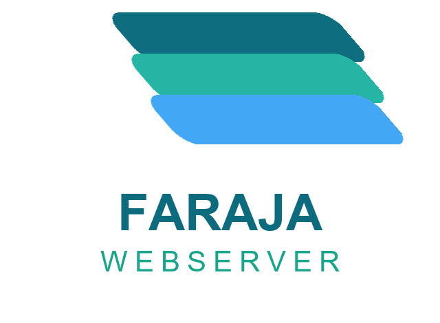
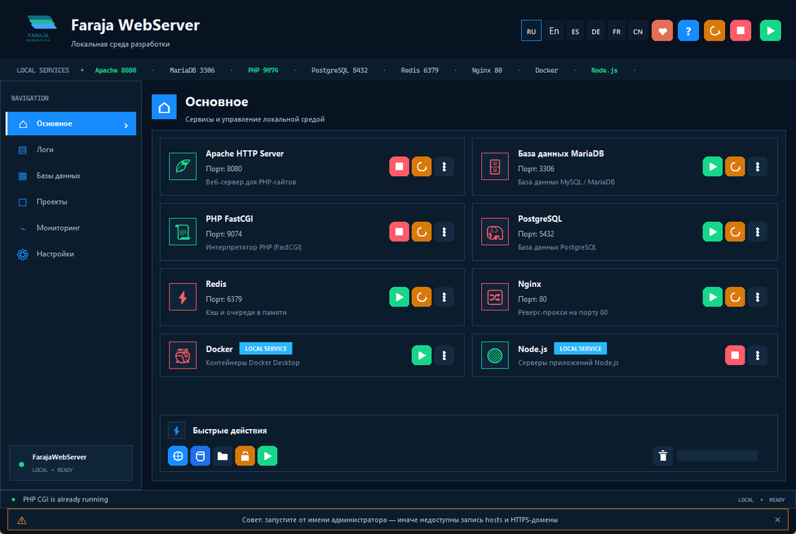
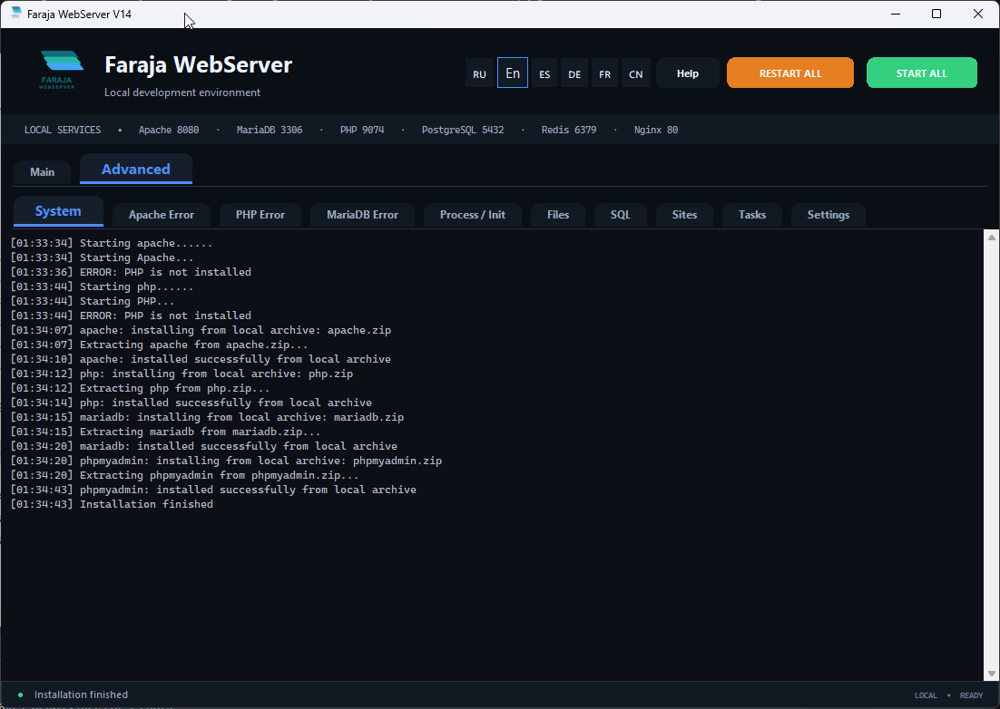
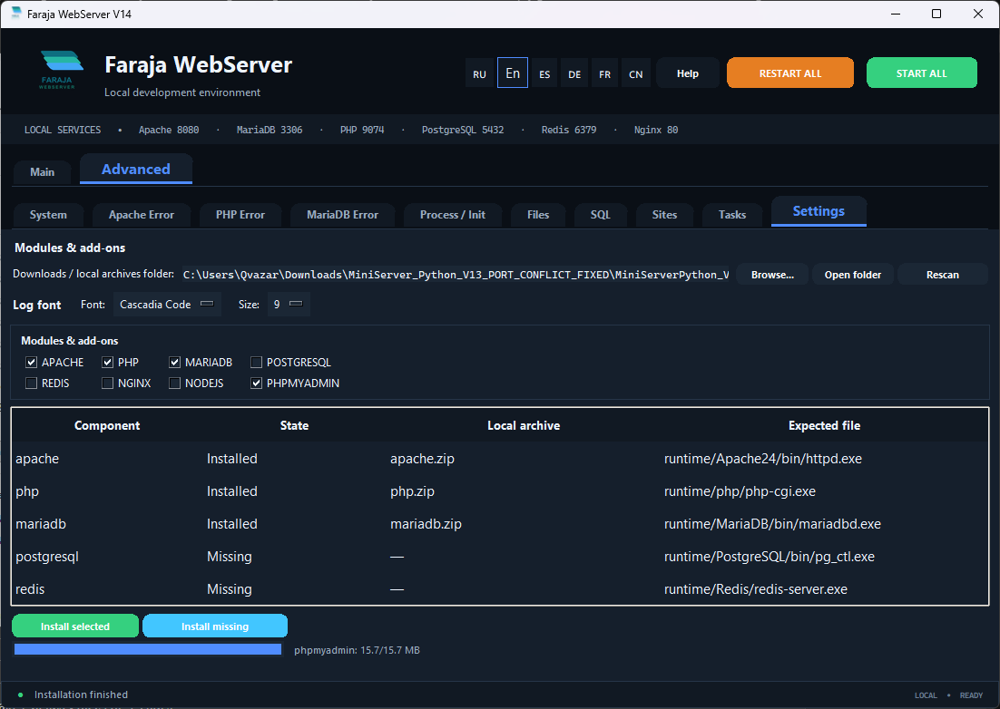
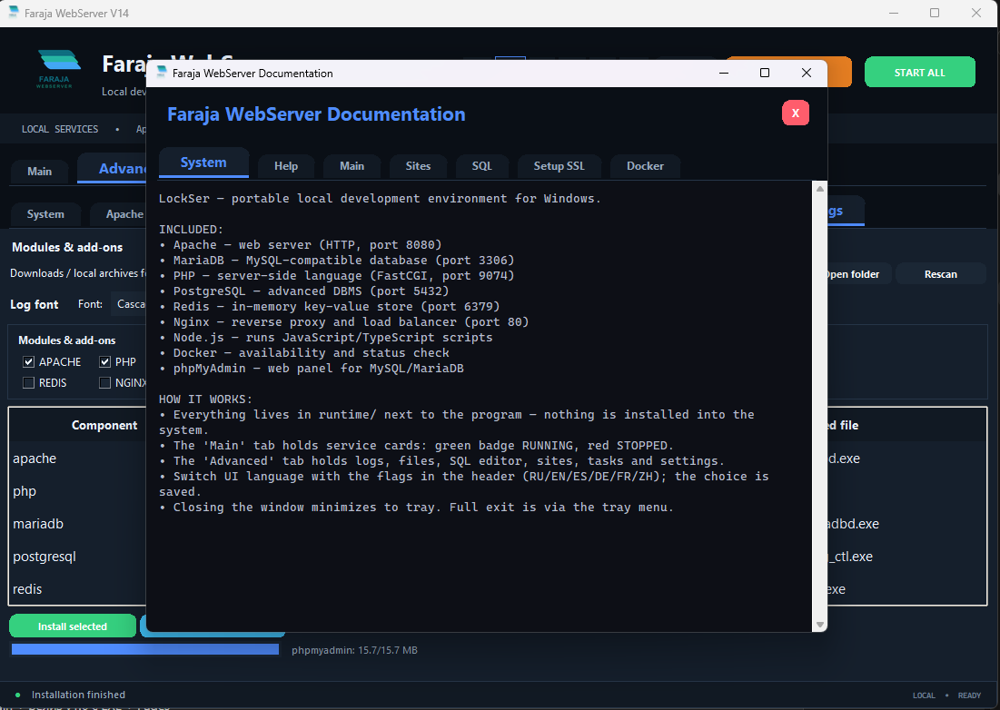
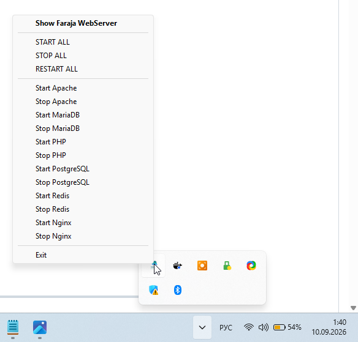

# Faraja WebServer

[](https://github.com/nsmykh70-creator/FarajaWebServer/releases/latest)
[](https://github.com/nsmykh70-creator/FarajaWebServer)
[](LICENSE)
[](MiniServer.py)

**Faraja WebServer** — портативная локальная среда веб-разработки для Windows.
Apache, MariaDB, PHP, PostgreSQL, Redis, Nginx, Node.js, Docker, локальный SSL —
всё в одном EXE. Ничего не устанавливается в систему.



**[⬇ Скачать FarajaWebServer.exe](https://github.com/nsmykh70-creator/FarajaWebServer/releases/latest/download/FarajaWebServer.exe)** ·
**[🌐 Сайт проекта](https://nsmykh70-creator.github.io/FarajaWebServer/)**

> *Название **Faraja** на языке суахили означает «Комфорт» — среда создана для комфортной разработки.*
> *The name **Faraja** means “Comfort” in Swahili.*

---

## Скриншоты

| Главная — сервисы | Логи | Настройки и модули |
|---|---|---|
|  |  |  |

| Помощь | Трей |
|---|---|
|  |  |

## Содержание

- [Возможности](#возможности)
- [Сервисы и порты](#сервисы-и-порты)
- [Быстрый старт](#быстрый-старт)
- [Установка компонентов](#установка-компонентов)
- [Сайты и файлы](#сайты-и-файлы)
- [Базы данных](#базы-данных)
- [Локальный HTTPS](#локальный-https)
- [Node.js и TypeScript](#nodejs-и-typescript)
- [Docker](#docker)
- [Задачи и автоматизация](#задачи-и-автоматизация)
- [Настройки](#настройки)
- [Языки интерфейса](#языки-интерфейса)
- [FAQ](#faq)
- [Сборка из исходников](#сборка-из-исходников)
- [Структура проекта](#структура-проекта)
- [Поддержать проект](#поддержать-проект)
- [Лицензия](#лицензия)
- [English](#english)
- [Español](#español)
- [Deutsch](#deutsch)
- [Français](#français)
- [中文](#中文)

## Возможности

- 🖥️ **Всё в одном окне** — карточки сервисов с кнопками Старт / Стоп / Рестарт,
  запуск всего стека одной кнопкой, сворачивание в системный трей.
- 🗄️ **Две СУБД** — MariaDB (совместима с MySQL) и PostgreSQL, встроенный
  SQL-редактор с таблицей результатов и phpMyAdmin из коробки.
- 🔒 **Локальный HTTPS** — доверенный SSL-сертификат для `localhost` в один клик
  (mkcert, корневой сертификат ставится в доверенные автоматически).
- 🌐 **Мультисайты** — добавляйте сайты, открывайте их в браузере одной кнопкой.
- 📝 **Редактор кода** — подсветка PHP, HTML, CSS, JS/TS, Python, SQL;
  несколько тёмных и светлых тем, мини-карта кода, номера строк;
  шрифт и тема запоминаются.
- ⏰ **Планировщик задач** — запуск команд по расписанию в cron-формате.
- 📦 **Менеджер модулей** — вкладка «Настройки»: видно, что установлено,
  чего не хватает, есть ли локальные архивы; установка выбранного в один клик.
- 🌍 **6 языков интерфейса** — русский, English, español, Deutsch, français, 中文;
  переключение флажками в шапке, выбор запоминается.
- 💡 **Всплывающие подсказки** и подробная встроенная пошаговая помощь
  (кнопка «Помощь» в шапке, на языке интерфейса).

## Сервисы и порты

| Сервис     | Назначение                         | Порт | Доступ по умолчанию              |
|------------|------------------------------------|------|----------------------------------|
| 🪶 Apache  | Веб-сервер (HTTP)                  | 8080 | `http://127.0.0.1:8080/`         |
| 🗄️ MariaDB | База данных (root без пароля)     | 3306 | через SQL-редактор / phpMyAdmin  |
| 📜 PHP     | Серверный язык (FastCGI)           | 9074 | внутренний, связывает Apache–PHP |
| 🐘 PostgreSQL | Продвинутая СУБД (postgres)    | 5432 | через SQL-редактор               |
| ⚡ Redis   | Хранилище «ключ-значение» в памяти | 6379 | без пароля                       |
| 🔀 Nginx   | Обратный прокси, HTTPS             | 80   | требует прав администратора      |
| 🟢 Node.js | JS / TS скрипты                    | —    | карточка показывает наличие      |
| 🐳 Docker  | Статус и управление контейнерами   | —    | нужен Docker Desktop             |

Порядок автозапуска: PHP → MariaDB → PostgreSQL → Redis → Apache → Nginx.
Порты меняются в `config/server.json` (создаётся при первом запуске).

## Быстрый старт

1. Скачайте `FarajaWebServer.exe` из
   [релизов](https://github.com/nsmykh70-creator/FarajaWebServer/releases/latest)
   и запустите (установка не требуется).
2. При первом запуске откроется **мастер**: отметьте нужные компоненты
   и нажмите «Установить». Можно указать папку с уже скачанными ZIP-архивами —
   они подхватятся автоматически.
3. Нажмите **«ЗАПУСТИТЬ ВСЕ»** в шапке — все бейджи сервисов станут зелёными.
4. Откройте в браузере `http://127.0.0.1:8080/` — стартовая страница.
5. Положите свой проект в папку `www/` (например `www/mysite/index.php`) —
   он сразу доступен по адресу `http://127.0.0.1:8080/mysite/`.
6. Проверьте PHP: создайте `www/info.php` с текстом `<?php phpinfo(); ?>`
   и откройте `http://127.0.0.1:8080/info.php`.

## Установка компонентов

- **Вкладка «Настройки»** — таблица всех модулей: состояние
  (установлен / отсутствует), найденный локальный архив, ожидаемый файл.
  Кнопки «Установить выбранное» и «Установить отсутствующие», свой прогресс-бар,
  смена папки загрузок.
- **Папка `downloads/`** — положите туда ZIP-архивы (именами вроде
  `httpd-*.zip`, `php-*.zip`, `mariadb-*.zip`), и установка пойдёт без интернета.
- Прогресс скачивания виден на баре в панели действий и в статус-строке.

## Сайты и файлы

**Сайты** (вкладка «Дополнительно» → «Сайты»):
1. «Добавить сайт» → введите имя (создастся `www/имя/` с `index.html`).
2. «Открыть сайт» — запуск в браузере
   (`http://127.0.0.1:8080/имя/` или свой порт, если задан).
3. «Открыть папку» — файлы сайта в проводнике.

**Файлы** — встроенный менеджер: двойной клик открывает папку/файл,
«Редактировать» — код с подсветкой синтаксиса, «Новый файл» подставляет
шаблон под расширение (`index.html`, `style.css`, `*.php`…).

## Базы данных

**SQL-редактор** (вкладка «Дополнительно» → «SQL»):
1. Запустите MariaDB (или PostgreSQL) на вкладке «Основное».
2. Выберите движок, введите логин/пароль
   (MariaDB: `root` без пароля; PostgreSQL: `postgres`).
3. Напишите запрос слева, нажмите «Выполнить» — результат в таблице справа.

Полезное для старта (MariaDB):

```sql
CREATE DATABASE mysite CHARACTER SET utf8mb4;
CREATE USER 'mysite'@'localhost' IDENTIFIED BY 'secret';
GRANT ALL ON mysite.* TO 'mysite'@'localhost';
```

Для визуальной работы нажмите **«phpMyAdmin»** —
панель откроется по адресу `http://127.0.0.1:8080/phpmyadmin/` (root без пароля).

## Локальный HTTPS

1. Нужен интернет (~5 МБ для скачивания mkcert).
2. Нажмите **«Настроить SSL»** на панели действий.
3. Программа скачает mkcert, установит локальный корневой сертификат
   (Windows спросит разрешение один раз) и выпустит сертификат
   для `localhost`, `127.0.0.1` и `::1` в папку `ssl/`.
4. Перезапустите Nginx — сайт доступен по `https://localhost/` (порт 443)
   без предупреждений браузера.

## Node.js и TypeScript

- Карточка **Node.js** на главной: СТАРТ ставит модуль (если его нет),
  проверяет версию и готовит `tsx`.
- Кнопка **«Запустить скрипт»** выполняет `.js` через Node, а `.ts` —
  через `tsx` без предварительной компиляции.

## Docker

- Карточка Docker показывает, найден ли Docker в системе
  (проверка идёт в фоне раз в 15 секунд и не тормозит интерфейс).
- Если Docker Desktop не установлен — кнопка СТАРТ предложит
  установить его с официального сайта.
- Контейнерами управляйте через терминал: `docker ps`,
  `docker stop <имя>`, `docker compose up -d`.

## Задачи и автоматизация

Вкладка «Задачи»: имя, команда (например `node server.js`) и расписание
в cron-формате (`0 2 * * *` — ежедневно в 2:00, `manual` — только вручную).
Кнопка «Запустить» выполняет задачу сразу, вывод виден в системном логе.

## Настройки

Вкладка «Настройки»:
- таблица модулей и установка недостающего;
- папка загрузок / локальных архивов (запоминается);
- **шрифт и размер шрифта логов** (применяется ко всем вкладкам логов сразу).

## Языки интерфейса

Флажки в шапке: 🇷🇺 RU · 🇬🇧 EN · 🇪🇸 ES · 🇩🇪 DE · 🇫🇷 FR · 🇨🇳 ZH.
Выбор сохраняется в `config/lang.json`. Документация и подсказки
переведены на все шесть языков.

## FAQ

**Порт занят — что делать?**
Ошибка назовёт процесс и PID. Закройте чужую программу (Skype, IIS, другой
сервер) либо смените порт в `config/server.json` и перезапустите сервис.

**PHP-страница пустая?**
Убедитесь, что запущены и Apache, и PHP. Подробности — во вкладках
«Ошибки Apache / PHP / MariaDB».

**Nginx не стартует?**
Порт 80 требует прав администратора — запустите программу от имени
администратора либо смените `nginx_port` в конфиге.

**Где смотреть, что происходит?**
Вкладка «Система» — общий лог; «Процессы / Инициализация» — вывод
запуска процессов. Шрифт логов настраивается в «Настройках».

**Куда класть свои файлы?**
В папку `www/` рядом с программой. Каждую подпапку можно оформить
как сайт через вкладку «Сайты».

**Программа пропала после закрытия окна?**
Она свернулась в трей (значок у часов). Полный выход — «Exit» в меню трея.

## Сборка из исходников

Требуется Python 3.12, Windows 10/11:

```bat
pip install -r requirements.txt
pyinstaller --noconfirm --onefile --windowed --icon "assets/logo.ico" ^
  --name "FarajaWebServer" ^
  --add-data "config;config" --add-data "www;www" --add-data "assets;assets" ^
  --add-data "components.json;." --add-data "requirements.txt;." ^
  --clean MiniServer.py
```

Готовый файл появится в `dist/FarajaWebServer.exe`.

## Структура проекта

```
MiniServer.py      — весь исходный код приложения (Tkinter)
components.json    — ссылки и версии скачиваемых компонентов
assets/            — логотип (logo.png/logo.ico) и иконки
www/               — корневая папка сайтов (index.html, index.php)
config/            — порты, сайты, задачи, язык (создаётся при запуске)
docs/              — лендинг проекта (публикуется через GitHub Pages)
```

## Поддержать проект

Если Faraja WebServer полезен — поддержите разработку (QR-коды есть в приложении, кнопка «❤ Поддержать» в шапке):

- **BTC:** `bc1q48l0mfvrs6kza5xs6qmzagatmpelrxzyqcwfhpz`
- **ETH:** `0x6889fD4d5B688d6E3c4b7E5A2B1D6E8F2C3A4b5D`
- **TRX:** `TN7V3t8EKjRTJFXNJwMjYpLqHGSQN7BTyv`

Спасибо!

## Лицензия

Apache License 2.0 — см. [LICENSE](LICENSE).

---

## Español

**Faraja WebServer** — entorno de desarrollo local portátil para Windows
(«Faraja» significa «Comodidad» en suajili): Apache 8080, MariaDB 3306
(root sin contraseña), PHP 9074, PostgreSQL 5432, Redis 6379, Nginx 80,
Node.js, Docker y SSL local — todo en un solo EXE, sin instalación.

**Inicio rápido:** ejecute el EXE → marque componentes → pulse **INICIAR TODO** →
abra `http://127.0.0.1:8080/` → copie su proyecto a `www/`.
HTTPS: pulse «Configurar SSL», reinicie Nginx, abra `https://localhost/`.
Idiomas: RU / EN / ES / DE / FR / ZH. Licencia: Apache-2.0.
Descarga: [FarajaWebServer.exe](https://github.com/nsmykh70-creator/FarajaWebServer/releases/latest/download/FarajaWebServer.exe)

## Deutsch

**Faraja WebServer** — portable lokale Web-Entwicklungsumgebung für Windows
(«Faraja» bedeutet auf Swahili „Komfort“): Apache 8080, MariaDB 3306
(root ohne Passwort), PHP 9074, PostgreSQL 5432, Redis 6379, Nginx 80,
Node.js, Docker und lokales SSL — alles in einer EXE, keine Installation.

**Schnellstart:** EXE starten → Komponenten wählen → **ALLE STARTEN** →
`http://127.0.0.1:8080/` öffnen → Projekt nach `www/` kopieren.
HTTPS: «SSL einrichten», Nginx neu starten, `https://localhost/` öffnen.
Sprachen: RU / EN / ES / DE / FR / ZH. Lizenz: Apache-2.0.
Download: [FarajaWebServer.exe](https://github.com/nsmykh70-creator/FarajaWebServer/releases/latest/download/FarajaWebServer.exe)

## Français

**Faraja WebServer** — environnement de développement local portable pour Windows
(« Faraja » signifie « Confort » en swahili) : Apache 8080, MariaDB 3306
(root sans mot de passe), PHP 9074, PostgreSQL 5432, Redis 6379, Nginx 80,
Node.js, Docker et SSL local — le tout dans un seul EXE, sans installation.

**Démarrage :** lancez l'EXE → cochez les composants → **TOUT DÉMARRER** →
ouvrez `http://127.0.0.1:8080/` → copiez votre projet dans `www/`.
HTTPS : « Configurer SSL », redémarrez Nginx, ouvrez `https://localhost/`.
Langues : RU / EN / ES / DE / FR / ZH. Licence : Apache-2.0.
Téléchargement : [FarajaWebServer.exe](https://github.com/nsmykh70-creator/FarajaWebServer/releases/latest/download/FarajaWebServer.exe)

## 中文

**Faraja WebServer** — Windows 便携式本地 Web 开发环境
（Faraja 在斯瓦希里语中意为“舒适”）：Apache 8080、MariaDB 3306
（root，无密码）、PHP 9074、PostgreSQL 5432、Redis 6379、Nginx 80、
Node.js、Docker 和本地 SSL — 集于单个 EXE，无需安装。

**快速入门：**运行 EXE → 勾选组件 → 点击「全部启动」→
打开 `http://127.0.0.1:8080/` → 将项目复制到 `www/`。
HTTPS：点击「设置 SSL」，重启 Nginx，打开 `https://localhost/`。
语言：RU / EN / ES / DE / FR / ZH。许可证：Apache-2.0。
下载：[FarajaWebServer.exe](https://github.com/nsmykh70-creator/FarajaWebServer/releases/latest/download/FarajaWebServer.exe)

## English

**Faraja WebServer** is a portable local web-development environment for Windows:
Apache, MariaDB, PHP, PostgreSQL, Redis, Nginx, Node.js, Docker status check and
local SSL — all in a single EXE, nothing installed into the system.

- **Download:** [FarajaWebServer.exe (latest release)](https://github.com/nsmykh70-creator/FarajaWebServer/releases/latest/download/FarajaWebServer.exe)
- **Site:** [nsmykh70-creator.github.io/FarajaWebServer](https://nsmykh70-creator.github.io/FarajaWebServer/)

**Quick start:** run the EXE → tick components in the first-run wizard → press
**START ALL** → open `http://127.0.0.1:8080/` → drop your project into `www/`
(e.g. `www/mysite/index.php` → `http://127.0.0.1:8080/mysite/`).
Default DB logins: MariaDB `root` with empty password, PostgreSQL `postgres`.
HTTPS: press **Setup SSL**, restart Nginx, open `https://localhost/`.
UI languages: RU / EN / ES / DE / FR / ZH via the flag buttons in the header.
Build from source with Python 3.12 — see [Сборка из исходников](#сборка-из-исходников).
License: MIT.
